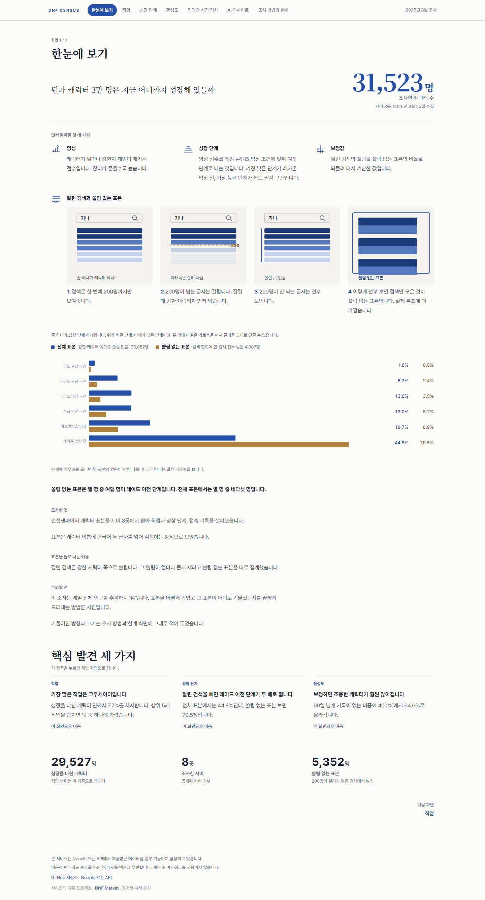
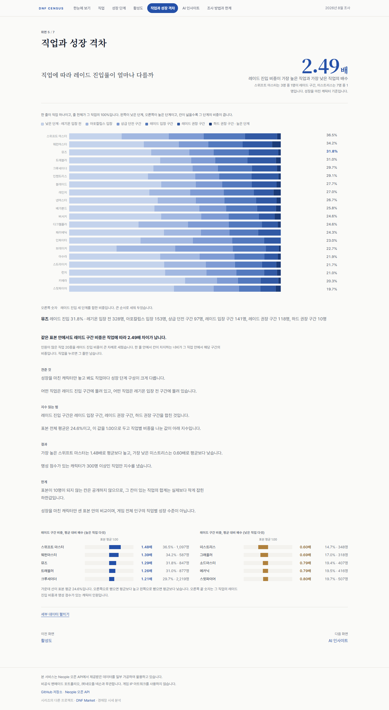

# DNF Census, 던파 캐릭터 표본조사

던전앤파이터 캐릭터 **31,523명 표본**을 Neople 오픈 API로 추출해, 유저들이 지금
어떻게 플레이하고 있는지(직업 분포, 성장 단계, 활성도, 직업 간 격차)를 통계조사
방법론으로 분석한 리포트입니다.
[DNF Market Analyst](https://github.com/Yegeon99/dnf-market-analyst)의 형제
프로젝트로, 시장에 이어 **유저**를 보는 두 번째 축입니다.

> 이 조사는 모집단 추정이 아니라 **표본조사 방법론의 시연**입니다.
> 표본 추출 방식의 편향과 한계를 리포트의 "조사 방법과 한계" 화면과
> [data/bias_notes.md](data/bias_notes.md)에 그대로 공개합니다.

**리포트**: https://dnf-census.vercel.app (2026-08 조사 회차)



### 직업과 성장 격차 화면



## 리포트 구성

상단 내비게이션과 해시 라우팅으로 나눈 7화면 인터랙티브 리포트입니다.
화면마다 제목, 핵심 수치, 본문 순서로 스크롤에 맞춰 나타나고, 대표 숫자는 화면에
들어올 때 한 번 세어 올라갑니다. 연출은 Anime.js가 맡고, 내비게이션의 현재 위치
표시와 펼쳐지는 상자만 Motion이 맡습니다. 움직임 최소화 설정을 켜 두면 연출을 건너뛰고
처음부터 완성된 상태로 보여 줍니다. 한 화면에
한 주제만 담고, 화면마다 리드 질문 하나와 이 리포트만의 메인 시각화 하나를 둡니다.
한눈에 보기에서 표본 피라미드로 조사 전체를 보여 준 다음, 직업과 성장 단계와
활성도를 차례로 훑고, 직업과 성장 격차에서 둘을 교차해 봅니다. AI 인사이트는
집계에서 읽어낸 것을 카드로 정리하고, 조사 방법과 한계는 표본 설계와 편향, 실측치를
모아 둡니다. 차트는 모두 평면입니다. 읽기 어려웠던 입체 화면 두 곳은 Bklit UI
(visx + Motion) 가로 막대로 바꿨습니다.

| 화면 | 주소 | 메인 시각화 |
| --- | --- | --- |
| 한눈에 보기 | `#overview` | 두 표본을 같은 가로축에 견주는 성장 단계 막대 |
| 직업 | `#jobs` | 직업군에서 전직으로 내려가는 2단 선버스트와 상위 15 가로 바 |
| 성장 단계 | `#growth` | 좌우 대칭 피라미드와 표본 전환 슬라이더, 명성 히스토그램 |
| 활성도 | `#activity` | 보정 전후 모핑 스택 바, 구간별 스트림 |
| 직업과 성장 격차 | `#gap` | 직업 20종의 성장 단계 구성, 100% 누적 가로 막대 |
| AI 인사이트 | `#insights` | 카드 8개와 확신도 필터, 카드별 미니 차트 |
| 조사 방법과 한계 | `#method` | 표본 설계 흐름도, 편향 목록, 개인정보와 실측치 |

## 이 리포트에서 쓰는 말

- **한도 검색**: 검색 결과가 200명 한도에 걸려 일부만 받은 검색입니다.
- **완전 검색 표본**: 한도에 걸리지 않아 해당 글자가 들어간 캐릭터를 빠짐없이 가져온 검색에서 나온 표본입니다.
- **편향 보정값**: 완전 검색 표본의 명성 분포를 기준으로 다시 계산한 값입니다.

## 실측치 (2026-08 회차)

| 항목 | 값 |
| --- | --- |
| 표본 크기 | 31,523명 |
| 명성값이 있는 표본 | 30,082명 |
| 완전 검색 표본 | 5,352명 (명성값이 있는 캐릭터 4,087명) |
| 활성도 조사 | 600명 (명성 6구간 층화 비례) |
| 주고받은 요청 | 약 933회 (검증 43, 직업 트리 1, 검색 289, 활성도 조사 600), 실패 0 |
| 모델 비용 | $0.0966 (배치 4회 누적, 인사이트 생성 2회와 문장 재작성 2회) |
| 수집 소요 | 검색 87초, 활성도 조사 181초 |
| Lighthouse | 배포본 데스크톱 성능 98, 모바일 85, 접근성과 권장 사례와 검색 100 ([docs/quality.md](docs/quality.md)) |

## 구조

```
pipeline/            # Python 파이프라인
  api_client.py      # Neople API 클라이언트 (0.3초 대기, 재시도 1회)
  sample.py          # CS-1 시드 검색으로 표본 프레임 (체크포인트 재개)
  timeline.py        # CS-2 층화 서브샘플로 활성도 판정
  aggregate.py       # CS-3 집계, 마스킹, 식별 정보 폐기 검증
  insights.py        # CS-4 AI 인사이트 (배치 1회)
config/              # 시드, 명성 구간, 활성 기준, 직업 정규화 맵
data/                # 집계 결과 (식별 정보 없음)와 편향 노트
report/              # Vite + React 7화면 리포트
  content/copy.md    # 화면 문구 전문 (빌드 산출물에서 자동 추출)
  src/lib/reveal.js  # Anime.js 스크롤 연출 (등장, 카운트업, 구분선, 시선 모으기)
  src/derived/       # 리포트 전용 파생 데이터
  scripts/           # 데이터 변환, 파생, 캡처, 문구 추출, 검사
scripts/             # 검증, 스캔, 대조 스크립트
docs/quality.md      # Lighthouse 점수와 지표 실측
```

## 재현

```bash
# .env에 NEOPLE_API_KEY (인사이트는 ANTHROPIC_API_KEY 추가)
python -m venv .venv && .venv/Scripts/pip install requests python-dotenv tzdata anthropic
.venv/Scripts/python pipeline/sample.py           # 표본 수집 (약 290콜, 90초)
.venv/Scripts/python pipeline/timeline.py         # 활성도 조사 (600콜, 3분)
.venv/Scripts/python pipeline/aggregate.py        # 집계
.venv/Scripts/python scripts/rewrite_insights.py  # 인사이트 문장 (배치 1회)
.venv/Scripts/python scripts/purge_ids.py         # 식별 정보 폐기와 스캔

cd report
npm install
node scripts/derive.mjs        # 명성 히스토그램과 직업 트리 (체크포인트 필요, 로컬 1회)
npm run build                  # 화면 용어 변환 후 빌드
node scripts/make-og.mjs       # 공유 카드 이미지 (report/public/og.png)
node scripts/capture.mjs       # 캡처와 화면 글 모음
node scripts/build-copy.mjs    # 화면 문구 전문
node scripts/font-check.mjs    # 세리프 글자가 폴백으로 안 떨어지는지
node scripts/stability.mjs     # 표시 안정성 (스크롤 연출이 다 도는지)
node scripts/reduced-motion.mjs # 움직임 최소화 설정에서 곧바로 완성된 상태인지
cd .. && python scripts/verify_final.py           # 숫자 정합성과 금지 표현 스캔
```

빌드 직전에 집계 파일을 읽어 내부 키 이름과 내부 용어를 화면 용어로 바꾼 사본을
만듭니다. 원본 집계 파일은 바꾸지 않습니다.

## 데이터 윤리 원칙

- 캐릭터명, 모험단명, 길드명은 **수집하지도 저장하지도 않습니다**. 캐릭터 식별자는
  활성도 조사 직후 되돌릴 수 없는 형태로 바꾸어 폐기하며, 커밋되는 어떤 파일에도
  식별 정보가 없습니다 (자동 스캔 0건 통과).
- 특정 캐릭터를 지목하는 서술을 하지 않습니다. 표본 10명 미만 칸은 공개하지 않습니다.
- 요청 예절을 지킵니다. 호출 사이 0.3초를 쉬고 재시도는 한 번까지만 하며, 상시로
  돌리지 않고 한 번만 모았습니다. 총 호출량은 사전 추정과 사후 실측을 함께 공개합니다.
- 모델 비용도 실측으로 공개합니다.

## 고지

본 서비스는 Neople 오픈 API에서 제공받은 데이터를 일부 가공하여 활용하고 있습니다.
비공식 팬메이드 포트폴리오이며 ㈜네오플, 넥슨과 무관합니다. 게임 IP 아트워크를
사용하지 않습니다.
