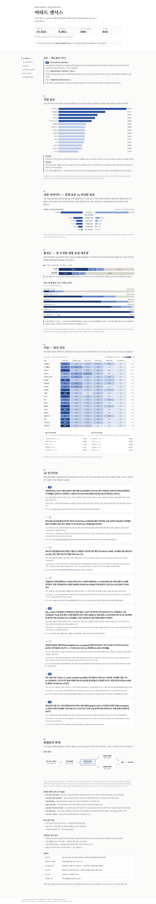
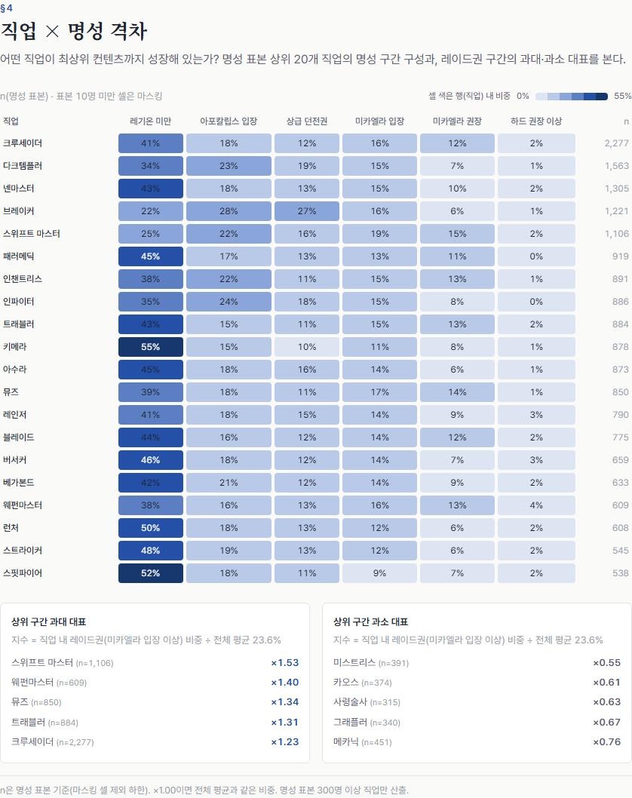

# Arad Census — 던파 캐릭터 표본조사

던전앤파이터 캐릭터 **31,523명 표본**을 Neople 오픈 API로 추출해, 유저들이 지금
어떻게 플레이하고 있는지(직업 분포, 성장 단계, 활성도, 직업 간 격차)를 통계조사
방법론으로 분석한 리포트. [DNF Market Analyst](https://github.com/Yegeon99/dnf-market-analyst)의
형제 프로젝트 — 시장에 이어 **유저**를 보는 두 번째 축.

> 이 조사는 모집단 추정이 아니라 **표본조사 방법론의 시연**이다.
> 표본 추출 방식의 편향과 한계를 리포트 §6과 [data/bias_notes.md](data/bias_notes.md)에서 그대로 공개한다.

**리포트**: https://arad-census.vercel.app (2026-08 조사 회차)



### §4 직업 × 명성 히트맵



## 실측치 (2026-08 회차)

| 항목 | 값 |
|---|---|
| 표본 크기 | 전체 31,523명 · 명성 표본 30,082명 · 비상한 5,352명 (명성 있음 4,087명) |
| 타임라인 서브샘플 | 600명 (명성 6구간 층화 비례) |
| API 호출 (누적) | 약 933회 — 검증 43 + 직업 트리 1 + 검색 289 + 타임라인 600, 실패 0 |
| LLM 비용 | $0.0707 (인사이트 배치 2회, claude-haiku-4-5) |
| 수집 소요 | 검색 87초 + 타임라인 181초 |

## 구조

```
pipeline/            # Python 파이프라인
  api_client.py      # Neople API 클라이언트 (0.3초 대기·재시도 1회)
  sample.py          # CS-1 시드 검색 → 표본 프레임 (체크포인트 재개)
  timeline.py        # CS-2 층화 서브샘플 → 활성도 판정
  aggregate.py       # CS-3 집계·마스킹·식별 정보 폐기 검증
  insights.py        # CS-4 AI 인사이트 (배치 1회)
config/              # 시드·명성 구간·활성 기준·직업 정규화 맵
data/                # 집계 결과 (식별 정보 없음) + 편향 노트
report/              # Vite + React 단일 페이지 리포트
scripts/             # Phase 0 검증·스캔·대조 스크립트
```

## 재현

```bash
# .env에 NEOPLE_API_KEY (인사이트는 ANTHROPIC_API_KEY 추가)
python -m venv .venv && .venv/Scripts/pip install requests python-dotenv tzdata anthropic
.venv/Scripts/python pipeline/sample.py      # 표본 수집 (약 290콜, 90초)
.venv/Scripts/python pipeline/timeline.py    # 활성도 조사 (600콜, 3분)
.venv/Scripts/python pipeline/aggregate.py   # 집계 → data/census_*.json
.venv/Scripts/python pipeline/insights.py    # AI 인사이트
.venv/Scripts/python scripts/purge_ids.py    # 식별 정보 폐기 + 스캔
cd report && npm install && npm run build    # 리포트 빌드
```

## 데이터 윤리 원칙

- 캐릭터명·모험단명·길드명은 **수집·저장하지 않는다**. characterId는 타임라인
  조사 직후 sha256 해시로 치환 폐기하며, 커밋되는 어떤 파일에도 식별 정보가
  없다 (자동 스캔 0건 통과).
- 특정 캐릭터를 지목하는 서술 금지. 표본 10명 미만 셀은 "표본 부족" 마스킹.
- API 매너: 호출 간 0.3초 대기, 재시도 1회, 1회성 배치 (상시 스케줄 아님).
  총 호출량 사전 추정·사후 실측 공개 (누적 약 933회, 실패 0).
- LLM 비용 실측 공개: $0.0707 (인사이트 배치 2회).

## 고지

본 서비스는 Neople 오픈 API에서 제공받은 데이터를 일부 가공하여 활용하고 있습니다.
비공식 팬메이드 포트폴리오 — ㈜네오플·넥슨과 무관합니다. 게임 IP 아트워크를 사용하지 않습니다.
